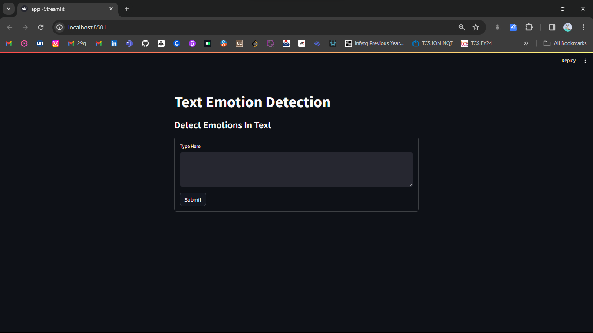
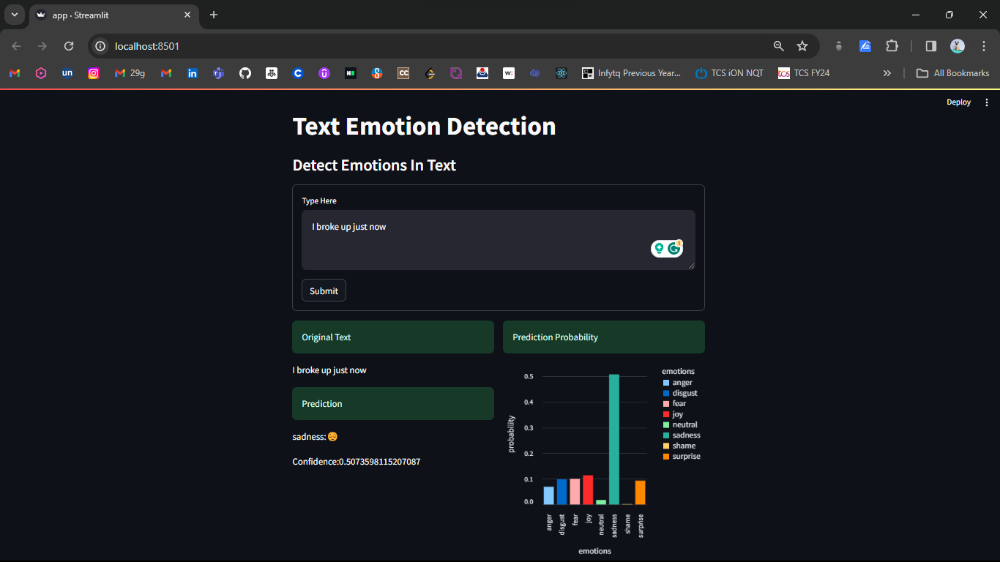

# Text Emotion Detection Application

This Python application leverages the Streamlit framework to create an interactive web interface for emotion detection in text. The underlying machine learning model utilizes Support Vector Machines (SVM) to predict the emotion associated with the input text. The application not only identifies the dominant emotion but also provides a visual representation of the prediction probabilities through a bar graph.

**Features**

**Text Input:**

Users can input text directly into the application, enabling real-time emotion analysis.

**Emotion Prediction:**

The SVM model processes the input text and predicts the most likely emotion associated with it.

**Probability Bar Graph:**

A dynamic bar graph is generated to visualize the prediction probabilities for each emotion category, providing users with insights into the model's confidence.


## Screenshots




## Usage

1. Clone the repository

```bash
git clone https://github.com/saurabhsinghaa/Text-Emotion-Detection.git
```
2. Use **cd** command in **Terminal** and go to the **Text-Emotion-Detection** directory (where app.py file is present).

3. Run the Application

```bash
streamlit run app.py
```
4. **Access the Application:** Open your web browser and navigate to http://localhost:8501 to interact with the emotion detection application.   
## Authors

- [@saurabhsinghaa](https://www.github.com/saurabhsinghaa)

